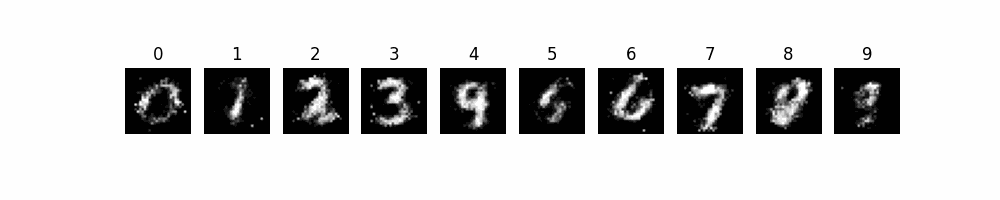

# 🎨 Conditional GAN для генерації зображень

## Опис проєкту 📄

Цей проєкт реалізує **Conditional GAN (Generative Adversarial Network)** для генерації зображень рукописних цифр із датасету **MNIST**. Conditional GAN дозволяє керувати генерацією, вказуючи **потрібний клас** (цифру).

### 🔍 **Основна мета**
- Генерувати зображення цифр від 0 до 9 на основі випадкового шуму та заданої мітки (цифри).
- Використання генеративних моделей для навчання на MNIST або подібних наборах даних.

---

## 🚀 **Особливості**
1. **Генератор та дискримінатор** створені за допомогою **PyTorch**.
2. **Conditional GAN** дозволяє вказати, яку цифру необхідно згенерувати.
3. **Збереження анімації**: генерується **GIF-слайдшоу** зображень для відстеження прогресу навчання.
4. Візуалізація результатів на **кожній епосі**.

---

## ⚙️ **Спостереження**
- Спершу була створена звичайна мережа GAN, з лінійними дискримінатором та генератором.
- Втім, трохи покопавшись, стало цікаво збудувати дещо модифіковану модель, де до вхідного вектору шуму також додається вектор лейблу, що дозволяє цілеспрямовано генерувати певні картинки.
- Приблизно з 80 епохи якість зображення не покращується, 200 епох це забагато.

## **Візуалізація навчання**

## **Роздуми, що можна зробити краще**
- при навчанні дискримінатора, можливо також є сенс аугментувати навчальний датасет, втім це може призвести до того, що він буде обганяти генератор і в результаті задушить його.
---

Щоб погратись з моделлю, потрібно викликати gan_call.py, та ввести цифру від 0 до 9.
